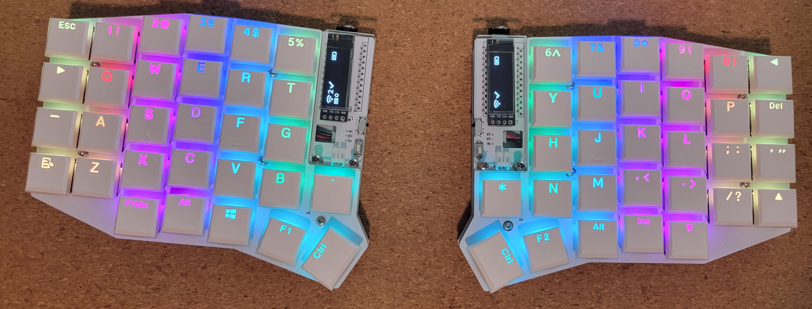

# Sofle Choc Wireless Keyboard

The Sofle Choc Wireless Keyboard is a revision of the Sofle Choc keyboard by [Brian Low](https://github.com/brianlow) with features that make it more suitable to building with wireless microcontrollers.

*The Sofle Choc Wireless Keyboard with an encoder and nice!view on the left half*

--
--

The following 2 pictures are the same exact board:

  *(Above: the Sofle Choc Wireless Keyboard with RGB LEDs and dual encoders)*

  *(Above: The Sofle Choc Wireless Keyboard with RGB LEDs and no encoders)*

The encoders in the first picture were hot-swapped for Choc switches in the second picture.
This allows for more build flexibility to change up your build, and as an added bonus, you can test out different rotary encoder options without soldering them in until you find one that you like.

## Disclaimer
This is a prototype keyboard, so it comes with no guarantees. There may be changes to it in the future to fix problems or add features. That being said, it functions as intended for my own standards, so if you like the design, feel free to get a PCB made and build it for yourself!

## Differences from Sofle Choc (wired) keyboard
- Added power switch to connect/disconnect battery power to RAW pin of microcontroller
- Added JST connector for battery connection
- [nice!view](https://nicekeyboards.com/docs/nice-view/) display support *(still supports common OLED displays as well)*
- Encoder can be swapped with a Choc switch on either half
    - These can both be hot-swapped if Mill-Max sockets are installed
- Added a bottom plate PCB to allow for more build options
- Made a hole in the PCB for battery wire routing if needed
- Position of the encoder is shifted down to allow room for a larger encoder knob
- 1 additional RBG LED on each half under the encoder / choc switch position
- Removed the TRRS jacks and related components
- Changed the microcontroller pin connected to the RGB LED data line

## Encoder Support
The PCB supports a rotary encoder or a Choc switch in the same location on either half, and *either one can use Mill-Max sockets*. If you don't want to use Mill-Max sockets, you can hard-solder either a rotary encoder or a Choc switch into either side.

## Display Support
The PCB supports either a 4-pin OLED screen commonly found on DIY keyboards, or the 5-pin [nice!view](https://nicekeyboards.com/docs/nice-view/) low power usage display.

## Firmware 

Sofle Choc Wireless uses [ZMK firmware](https://zmk.dev/)

Firmware-related info for display and LED features:
  - This PCB has a chip select (CS) pin for the nice!view display that uses Arduino Digital 1 (D1 Pro Micro pin), which corresponds to P0.06/006 on the nice!nano. This is the default pin used by the nice!view, which makes it easier to configure. See build guide "Firmware and programming" section for more info on building firmware that supports the nice!view.
  - The RGB LED pin is relocated to Arduino Digital 0 (D0 Pro Micro pin), which corresponds to P0.08/008 on the nice!nano

### Example config repository
There is a zmk-config example repository where each branch has a different combination of options (OLED, niceview, RGB) enabled:
https://github.com/db-ok/zmk-config-soflechocwireless

## Build Guide

Please read the entire build guide before ordering any parts, as there are some options to consider:

[Build guide](docs/build_guide_choc_wireless.md)

## From the original Sofle repo:

Original SofleKeyboard repo: https://github.com/josefadamcik/SofleKeyboard

Sofle is 6×4+5 keys column-staggered split keyboard with encoder support. 

Based on [Lily58](https://github.com/kata0510/Lily58), [Corne](https://github.com/foostan/crkbd) and [Helix](https://github.com/MakotoKurauchi/helix) keyboards.

SofleKeyboard was created by [Josef Adamcik](https://josef-adamcik.cz/). The motivation and process is covered in following blog-post: [Let me introduce you to SofleKeyboard - a split keyboard based on Lily58 and Crkbd](https://josef-adamcik.cz/electronics/let-me-introduce-you-sofle-keyboard-split-keyboard-based-on-lily58.html)

Sofle RGB was contributed by [Dane Evans](https://github.com/DaneEvans).

Sofle Choc was designed by [Brian Low](https://github.com/BrianLow)

## Using Acrylic Plates & Magenet

