# Sofle Choc Wireless Keyboard - build guide

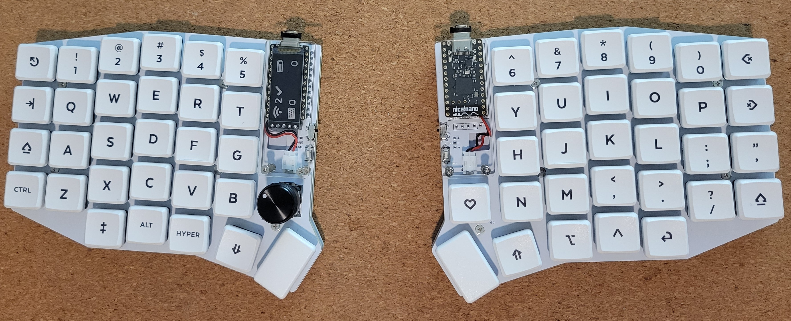
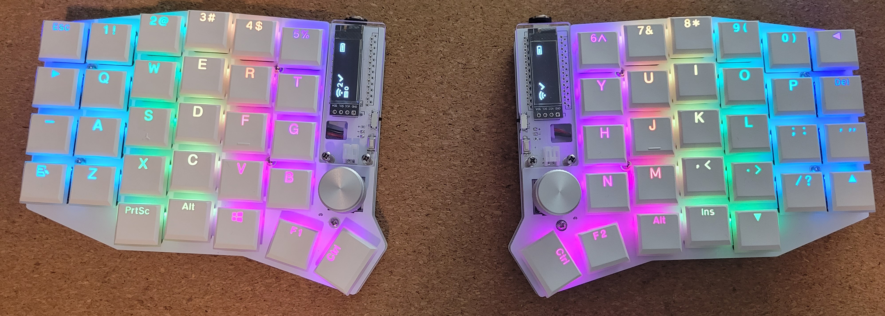
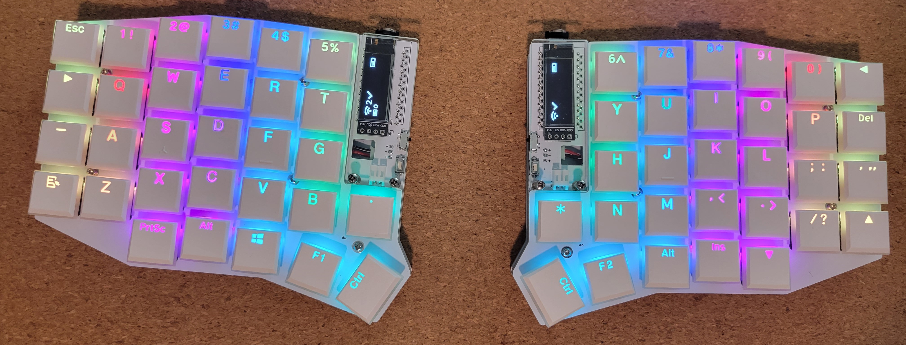

Sofle Choc Wireless"是"Sofle Choc"的一个分支，具有：

   - 电池供电的开关
   - 电池端子/ JST连接器
   - 支持如[nice!view](https://nicekeyboards.com/docs/nice-view/)这样的5脚显示器

此版本支持[Kailh Choc v1轴体](https://deskthority.net/wiki/Kailh_PG1350_series)。需要Kailh热插拔插座。每个按键的RGB是可选的，并使用相对易于焊接的SK6812 MINI-E LED。该键盘的顶板与任何其他Sofle版本不兼容。为了将厚度最小化，底板是可选装配的。它应该也可以与Sofle Choc 一样在有线模式下工作。

"Sofle Choc Wireless"是由db基于[Brian Low](https://github.com/brianlow)设计的"Sofle Choc (有线)"设计的，这是基于[Dane Evans](https://github.com/DaneEvans)的优秀"Sofle RGB"的，而"Sofle RGB"又是基于[Josef Adamčík](https://github.com/josefadamcik)的原始"Sofle v2"。

## 制作键盘的方式

这款键盘可以根据你的偏好以不同的方式组装。以下是我组装这款键盘的两种样式的简化版本，以及它们之间主要不同的组件：

|*组件*|Low-power consumption/Lowest profile|High battery capacity|
|---------------|---------------|---------------|
|*电池*|301230 LiPo|306080 LiPo|
|*底板*|可选装配|需要装配|
|*显示屏*|nice!view (或不装配)|OLED or nice!view (依然是可选装配的)|
|*RGB LEDs*|不建议装配|用吧 :)|
|*底板垫片与支撑柱*|5mm (如果没有底板也可以不用)|9mm|

*注意：使用低功耗选项可以装配非nice!view的OLED双色显示屏，但是这一样也会很显著地耗干电池容量*

这只是可以选择的几个选项之一，但这绝不是组装这款键盘的唯一方法。其他人可能选择结合两者的元素，例如，不带底板的组装，但保留RGB LED。这个选项也意味着你必须仔细考虑你的固件设置，例如启用ZMK配置选项中当键盘未插入USB时关闭LED的选项：`CONFIG_ZMK_RGB_UNDERGLOW_AUTO_OFF_USB = y`。否则，电池寿命会非常短，导致键盘无法使用。

### 电池使用情况

- 低功耗构建的电池寿命将显著长于其他样式的电池，假设你的电池容量大约为100mAh，这对301230型号的LiPo电池组来说是常见的。使用这种方式进行构建，中心部分的电池寿命大约可以达到7天，周边部分的电池寿命可能会更长一些。

- 对于选择高电池容量构建选项，安装RGB LED，和使用306080 LiPo电池的情况，您在保守亮度水平（<50%）的情况下最多只能使用几天，而且要使用一种在相对短的超时期（约5分钟）后关闭LED的配置。这是假设306080 LiPo电池的容量约为2500mAh，这是我用于这种构建方式的电池类型。
  - 更大的电池也需要更长的充电时间，所以推荐在此类构建中使用nice!nano v2上的更高充电电流跳线。如果没有更高的充电电流，充电电流为100mA，所以2500mAh的电池可能需要长达25小时的充电时间 :( 用更高的充电电流（500mA）充电，一个2500mAh的电池从完全放电到完全充满大约需要5小时。如果你一整天都在使用，然后在一天结束时插入电源充电几个小时，你的电量应该始终处于一个相当舒适的水平。

  - 这是我的经验，但是你的情况可能会有所不同，这种构建方式肯定有它的妥协 -- 大部分是为了RGB，因为LED無疑是最大的电力消耗者。

你可以参考ZMK功率设定的文档以获取更多细节：https://zmk.dev/power-profiler

## Bill of materials

如下是组装键盘所需要的物料清单:

- **2 块顶板（定位板）** - 发送压缩文件`Gerbers\SofleChocWirelessTopPlate\SofleChocWirelessTopPlate.zip`给PCB制造服务商。顶板用于固定轴座，它的厚度应该是1.2mm。我使用的是JLC PCB的默认设置，唯一的自定义的部分就是PCB的颜色。

- **2 块底板PCB (可选配)** - `Gerbers\SofleChocWirelessBottomPlate\SofleChocWirelessBottomPlate.zip`. The bottom plates can be 1.6mm or 1.2mm thick PCBs, either will work.底板可以选用1.6 mm或者1.2 mm的，选择其中一个即可。
- **10 个M2 螺柱 (每边各5个)** - 如果你打算将你的电池放在为控制下方并且使用底板，那么5mm的螺柱足够长了，此时底板不会碰到PCB板上的轴座(不要忘了还有额外的4个螺柱，如果你需要给显示屏幕覆盖一层保护壳的话 -- 浙江需要10 到 12 mm 长度的螺柱以适配微控制器和显示屏)
- **20 个M2 螺丝** - 这些用于将底板连接到顶板（如果你的建造包含此项，不要忘记你需要更多的8个螺丝用于连接显示器覆盖板（每侧4个））。如果使用5mm或更短的间隔器来连接底板，你会希望螺丝具有3mm或4mm的轴，这样它们在间隔器内部就不会相互碰撞。

- **2 块兼容无线Pro Micro的微控制器开发板** 比如 [nice!nano](https://nicekeyboards.com/nice-nano#find-a-store), [nrfMicro](https://github.com/joric/nrfmicro/wiki), 或者 [BlueMicro840](http://store.jpconstantineau.com/#/item/BMicro840)。我只使用过nice!nano v2，所以这是我知道的唯一支持如上特性的板子。

- **4组 12 pin的排针(同时k而选配对应的排母)** - 这是给微控制器使用的。为键盘安装微控制器有几种不同的方式。你可以直接将微控制器板配备的公投直接焊接到键盘上，但是这样的话如果你的微控制器出现问题的话将会使得你更换微控制器变得困难，所以这种方式并不推荐；还有一个方式就是将Pro Micro使用二极管的针脚的方法与12pin的排母组成热插拔的安装方式，你可以参考splitkb.com的文章。 直插排母用在类似的键盘上，可以提供一个紧凑的、非永久性的连接，但并不总是可用的。如果要在微控制器下方安装301230型的锂电池，你需要4毫米高的排母，主控需要用组件朝上的方式安装。

- **58 to 60 Kailh Choc keyboard switches** - 必须使用 [Kailh Choc v1 热插拔轴体 (PG1350)](https://deskthority.net/wiki/Kailh_PG1350_series)，颜色可以根据喜好选择。`PG` 前缀可能会被忽略。 **不要** 购买 [Kailh Choc v2](https://deskthority.net/wiki/Kailh_PG1353_series), [Kailh Mini Choc](https://deskthority.net/wiki/Kailh_PG1232_series) 或 [Cherry MX](https://deskthority.net/wiki/Cherry_MX)。 如果两块PCB板都是用旋钮编码器，那么58 个轴体足够了；如果使用轴座的话，那么需要60个。

- **58 凯华热插拔轴座** - 必须使用PG1350的轴座。PCB需要使用轴座，如果你选择使用旋钮编码器的方案，那么你就不需要在对应的位置上焊接轴座。The PCB requires sockets. Switches cannot be soldered directly to the board, with the only exception being if you choose to put a switch in place of the encoder, that switch can be soldered, but Mill-Max sockets are recommended instead.

- **58 ~ 60 个矮轴键帽**. 可以全部使用`1u`尺寸的键帽，但是两个拇指键的可以使用`1.25u`或`1.5u`的。

- **60 个1N4148W二极管**. 使用SOD123封装的都可以。

- **2 个按钮** 这是给Reset功能用的. 自锁的, 贴片式的, 穿孔的, 2脚的: 3x6x4.3mm 大小的. 可选的方案：你可以直接使用金属镊子来触发reset，但是使用按钮会更方便。 类似[这样](https://www.amazon.com/gp/product/B07H9ZSZD4/)的穿孔的按钮就是为了这种板子设计的，但是你也可以使用SMT的按钮。如果要使用SMT的按钮，你需要将阵脚弯折到45°，使其可以与洞孔接触。[这种](https://www.digikey.com/en/products/detail/c-k/PTS636-SM25F-SMTR-LFS/10071742) 开关就很适合, 并且他们的高度也更低一点。

- **2 块SPDT SMT 滑动开关** for battery power on/off switches. This is a common style, similar to the ones found [here](https://www.digikey.com/en/products/detail/nidec-copal-electronics/CUS-12TB/1124222), [here](https://mkultra.click/alps-ssss811101/), or [here](https://www.amazon.com/gp/product/B00E6QJ6YK).

- **8 - 10 防滑垫**. 用于防止底部键盘打滑。如果你选择使用底板，那么尽量选择最小、最薄的选项（大约2毫米或更薄），我还建议你选择带有尽可能薄的头的平顶螺丝，以减少螺丝超过橡胶脚厚度而触底的机会。这可能会导致螺丝刮伤键盘所在的表面。另外，如果你不使用底板，你的防滑垫可以安装在PCB的底部，应该稍微突出于热插拔插座的厚度，这些插座通常是那侧板上最厚的部件。如果不使用底板，2毫米应该接近你希望的减震器的最小厚度。3毫米会稍微安全一些。

- **2x LiPo Batteries** 
  - *最紧凑的选项*, 并且能完美贴合到主控下方空间的,就是301230锂电池, 它的厚度是3mm, 并且长度也比主控板的长度要小，对于低电池容量的组装来说是最佳选择。如果使用JST连接器进行连接, [这些电池](https://mkultra.click/301230-lipo-battery-with-jst-connector/) 都能很好工作, 他们都有JST的插头。 其他选择是将电池线直接焊接到PCB上的+/-端子上，接上带有JST插头的线束，或者自己在电池线的末端压接一个JST连接器。 
  - *如果你选择使用大容量电池的话* (比如说为了获取LED还有OLED显示屏的功能), 你可以通过在顶板和底板之间安装更长的螺柱（在这种情况下9毫米适用）并将较大的电池夹在PCB和底板之间来做到这一点。这适用于306080型号的锂聚合物电池包，它刚好可以安装在固定顶板和底板的两列螺丝之间。为了防止它移动，我首先在PCB背面放上一层粘面向外的胶带，尺寸稍大于电池包的尺寸。然后，我用粘性一面朝外的胶带制成一个环，将电池粘在PCB背面的胶带的非粘性一面上。这只是一个简单便宜的办法，看起来效果还不错。在这种配置下，底板将电池紧贴在PCB附近，所以胶带真的不能剥落，让电池滑动。但是需要注意：永远不要对锂聚合物电池包施加压力，所以确保螺柱长度适当，不会导致底板压在电池包上或压到主PCB背面的元件。这很容易导致电池出现问题。

*下图是使用306080电池的安装示例*
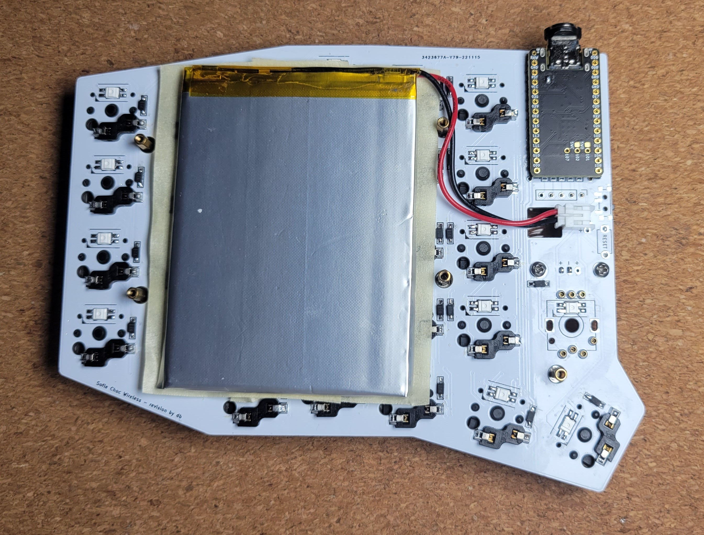

可选原件:

- **Up to 14 Mill-Max sockets** 14 Mill-Max sockets will cover all possible positions they can be installed on this keyboard, including 5 for each encoder, plus 2 for each Choc Switch (x2 to cover both halves). These are completely optional, but installing all of them will allow for swapping out an encoder for a Choc switch on either or both sides. Mill-Max part number [3305-1-15-80-47-27-10-0](https://www.mill-max.com/products/receptacle/3305/3305-1-15-80-47-27-10-0) are tested and good for this application. They have an outer shell that looks silver as the outer coating material is tin over nickel.  This version is also an option: [3305-1-15-15-47-27-10-0](https://www.mill-max.com/products/receptacle/3305/3305-1-15-15-47-27-10-0). The size and shape are the same, the only difference seems to be the outer plating material on these is gold. The points where the switch comes in contact with the socket is gold for both of these options. The important characteristic for these to work well in this board is that they should sit as low as possible above the surface of the PCB so that when using a Choc switch, it sits as flat as possible on the PCB.

- **JST socket** For connecting a battery. This is optional, as you can hard-solder the battery +/- wires to the +/- terminals on the keyboard PCB, but using the JST connector will allow for changing the battery without soldering or desoldering it. 
This option will work with most LiPo batteries that have a JST connector (JST PH 2.0mm): [S2B-PH-K-S(LF)(SN)](https://www.digikey.com/en/products/detail/jst-sales-america-inc/S2B-PH-K-S-LF-SN/926626).

**Choose either 4-pin OLED displays (1 or 2), nice!view displays (1 or 2) or no display at all**

- **For displays**
  
  - **OLED option - 1 or 2x SSD1306 128x32 OLED display module** - 4-pin, I2C, 0.91". Very common.
      - **1 or 2x 4 pin header (and optionally socket)** - for OLEDs. These sometimes come included with the OLED unit, and may be pre-soldered. You can solder the OLED directly to the board. Ideally use a socket so you can replace and/or get to the microcontroller underneath. 4 pin female headers with half height (~4-5mm) insulation work well.
  
  - **nice!view option - 1 or 2x nice!view displays** - these come with a set of 5-pin male pin headers and a half-height 5-pin female socket

  - **OLED Covers**

    - **2 OLED covers cut from acrylic** - Technically optional, but displays seem pretty fragile to me without them. The files for these are in the `SofleChocWireless/Case/OledCover` folder. The same OLED cover from the Sofle RGB also works: this is the file called `oled-cover-option1` in either svg or dxf format. `oled-cover-option2` is modified to give more space for a slightly larger encoder knob, but otherwise is functionally identical. These are typically laser-cut from 3mm thick acrylic.
    - **4 M2 spacers/standoffs (female/female threaded) to mount the OLED covers*** - (2 for each). The height of these depends on how high your microcontroller sits off the PCB, and ultimately the height of the display. 10mm spacers will work for most configurations, but 12mm may be required if using a socketed microcontroller with a display.
    - **8 M2 screws** - to attach the OLED covers and spacers to the PCB. 5mm to 6mm shaft M2 screws work well for this, as the acrylic used for the display covers is typically 3mm thick.


- **Rotary encoders**

    - **1 or 2 Rotary encoders EC11** - If you're not sure, take EC11E. Some other variants (EC11K) may have some additional plastic pins and require mounting holes for them which are not included on the PCB. Some encoders do not include a push-button switch, so look for encoders that include this feature when buying if you want that functionality.
      - A couple of encoder options:
          - [TT Electronics EN11-HSB1AF15](https://www.digikey.com/en/products/detail/tt-electronics-bi/EN11-HSB1AF15/2408764) - Not super low-profile, but an excellent option. It has a smooth rotation feel, and is fairly easy to turn. The detents have a rounded bump to them. Has a D-shaped shaft and a green plastic base. Also of note is that this model is oriented in the opposite rotation direction as some other encoders in terms of the electrical signals it produces, but this is not an issue, as your keymap can be configured to simply swap the left and right rotation key mappings as needed, in order to match the key mapping to the proper rotation direction. Important spec for ZMK firmware configuration: 20 pulses per rotation.
          - Amazon option: https://www.amazon.com/gp/product/B0177VGSQY - about as low profile as you can go while also having an integrated push-button switch and a D-shaped shaft that fits readily available knobs. This one is even easier to turn than the TT Electronics model. The detents are less forceful, so it gives less of a tactile feel during rotation. It has a D-shaped shaft and a green plastic base. Build quality seems lower than the TT Electronics model, but the overall height is also a little lower if you're trying to achieve a lower profile build. Pulses per rotation: unknown (no data sheet provided).

    
    - **Matching knobs** - for each encoder. Make sure the knob matches the encoder's shaft diameter, depth and shape. All of the above encoder options will fit knobs with a 6mm shaft opening. Encoder shafts can be either D-shaped or knurled, which require the corresponding type of knobs to fit them. Knobs up to 20mm in diamater will fit without bumping into any of the keys or the (optional) OLED cover. A larger knob may even be possible to install, but I have not tried one larger than 20mm, since it comes within 1 or 2mm of the the OLED cover. A larger knob will result in the encoder feeling easier to turn, which I find preferable over a smaller diameter. 
    
      Commonly available knobs made for D-shaft encoders come with a set screw that holds them in place against the flatted end of the encoder shaft. The set screw typically has a hex head, and sometimes the knobs will come with a hex key, but unless specifically mentioned, they do not. Typically, they require either a 1.5mm or 2mm hex key or hex driver. 
    
      These considerations all apply to D-shaft knobs, however there are knurled shaft encoder and knob options, I'm just not very familiar with those and their various options.

- **LEDs**
  - **60 SK6812 MINI-E RGB LEDs** - The LED body 3.2x2.8x1.7mm and with legs is 5.8x2.8. Avoid the non-MINI-E version without the legs. Purchase a few extra as they are somewhat delicate.

## Tools and materials

- soldering iron and solder
- no-clean flux makes soldering easier
- solder wick or desoldering pump to correct mistakes
- good tweezers
- flush cutters to trim diode legs when socketing the microcontroller
- masking, kapton or electrical tape
- isopropyl-alcohol for cleaning
- small screwdriver
- mulitmeter for troubleshooting


## Build steps

### Prepare

Make sure you know which side you are working on, and don't make two left hand sides by mistake. Stick a piece of tape on the front side of both PCBs to help remember.

This guide is written in the order to install the components.

We will start with the components on the back, shortest to tallest:
  - diodes
  - LEDs (optional)
  - switch sockets

Then install the components on the front:
  - Display jumpers (if installing a display)
  - Microcontroller & socket
  - Display & socket
  - Reset switch
  - Encoder

The order of assemby does not matter **except** for these 3 components because they stack on top of one another:
  1. the display jumpers
  2. the microcontroller
  3. the display

### Switch Sockets and Diodes

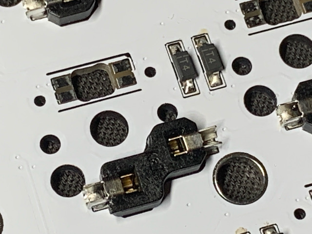

这些元件放置在PCB的背侧。

 二极管上的白色标记必须要与PCB上的丝印箭头标记匹配。我的焊接方法是先在二极管对应的焊盘的其中一个先垫上一些焊锡，然后移开烙铁等待焊锡冷却，接着用镊子夹住二极管将其正确地放置在PCB对应的位置上，并施加一个向下的压力，同时用电烙铁加热刚刚冷却的焊锡使二极管可以平整地摆放到合理的位置，当摆放位置确定好后移开电烙铁。


考虑到你将在电路板的每一半上做30次相同的步骤，我发现整个电路板最高效的方式是：

1. 在电路板上每个二极管位置的一个焊盘上预先滴上熔锡
2. 将所有的二极管放在电路板上它们将要被焊接的位置旁边，并指向正确的方向
3. 去每一个二极管那里，按照上面提到的过程焊接第一个焊盘
4. 回到每一只二极管，焊接第二个焊盘，直到所有的二极管在两个焊盘上都被焊死
5. 仔细检查每一个二极管，确保你没有漏掉任何一个

热拔插开关插座是电路板背面最大和最容易焊接的组件。它们被安装在电路板的背面，面向电路板的前面，当放入电路板的孔中时，它们会与电路板丝印的轮廓相匹配。焊接时，确保它们完全贴平在电路板上。要焊接它们，就加热位于插座边缘的金属连接器，它位于电路板焊盘的顶部，添加熔锡，看熔锡是否被吸入到电路板中。你想要一个完全的连接，因为这可能会承受从开关安装和拆除过程中的一些机械应力，所以在这些连接处不需要吝啬使用熔锡。在焊接连接点时，用镊子施加一些压力将插座固定住会有所帮助。
### Mill-Max 底座 (可选配)

每一边的PCB板子上可以安装7个Mill-Max插座，两个半部分共计14个。它们可以安装在用于编码器的5个小圆形针脚上（更大的椭圆形安装点孔不需要），以及用于可以在同一位置安装的Choc轴体的2个针脚上。（如下图所示）

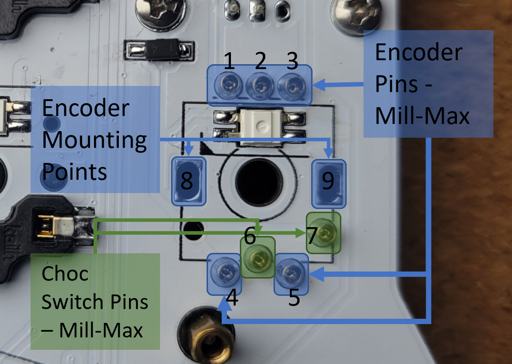
(*Above: view of the Mill-Max locations from the bottom of the PCB*)

See above for locations where Mill-Max sockets can be installed: 
- Pins 1 through 5 are used by the encoder. Mill-Max sockets can be installed here if desired.
- Pins 6 and 7 are use by the choc switch (these are reversed on the opposite half). These can also use Mill-Max sockets.

Pins 8 and 9 are mounting point attachments for the encoder. These 2 pins can be soldered to the mounting legs of the encoder to provide more stability.

If not using Mill-Max sockets, the encoder or Choc switch can be soldered in at a later step. If installing a Choc switch without Mill-Max sockets, do this after all other components have been installed and the top plate is put in place. Probably best to leave the switch until the very last step to install if you choose this option.

To make it easier to install these, it's best to do it before anything has been soldered to the top side of the PCB, so that you can lay the board flat with the Mill-Max sockets in place, and they'll be pressed firmly into the PCB. 

**To install the Mill-Max sockets:**

1. With the PCB face up, place them into the holes
2. Then, tape over them on the front side of the board to keep them in place. Masking tape works well for this.

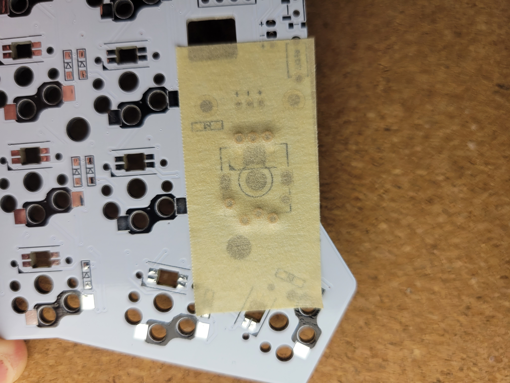
(*Above: view of the top of the PCB with tape over the Mill-Max sockets before soldering*)

3. Then, flip the board over, making sure they're pressed into place firmly before and during soldering, and solder them from the back side of the PCB, where the diodes and sockets are soldered. It helps to have a very small diameter solder wire (I prefer 0.5mm) to solder the sockets. Heat up the side of the socket and the through hole pad together, then feed a small amount of solder into the joint until the solder wicks around the edge of the socket. Be careful to avoid getting any solder into the center of the socket.


### LEDs (可选配)

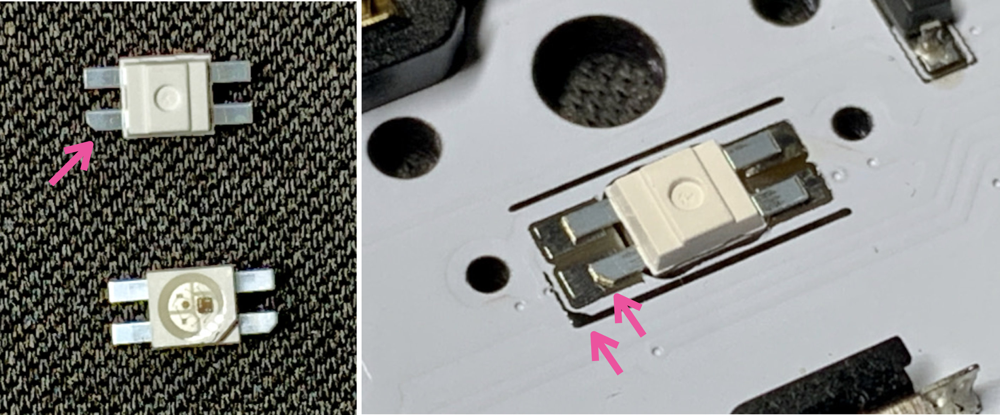

LEDs are placed on the back of the PCB. The lens should point up through the PCB so they shine into the bottom of the switch. One leg will have a diagonal cut. This cut leg should be aligned with the triangular marking on the PCB.
LED 放置在PCB的背面。LED的镜面会通过PCB在PCB的正面被观察到，因此他们可以作为底灯
To solder: First, use a lower temperature setting to solder the RGB LEDs. I use 270C, but some use lower, some use higher. Tin one pad, place the LED and hold using tweezers, apply heat to the leg until the solder melts and the LED is flush with the board. Now the remaining legs can be soldered without the component moving. The LEDs are sensitive to heat. Let the LED cool between soldering each leg. Use the lowest heat needed for your solder.

The LED control circuit is in one long chain. If one LED is not working, inspect the connections for that LED and the LED preceeding it. Sometimes just the output of a LED is damaged. The full chain does not need to be installed if you want to test a partially built board. The top inner-most LED closest to the top of the microcontroller is the first one in the chain, and they snake around the board, going down first, then back up on the next column, etc.

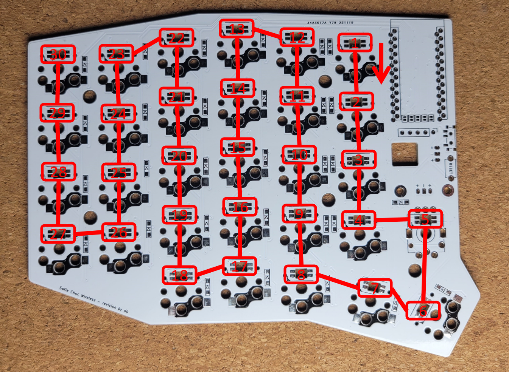

### Display Jumpers

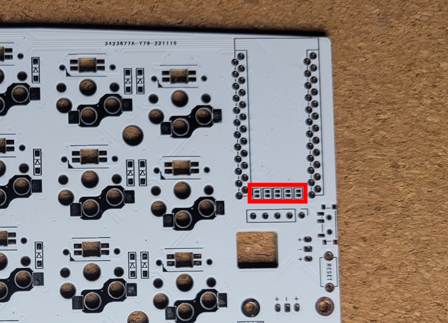

The jumpers in the above photo should be bridged if using a display. The jumpers may not be accessible later in the build depending on how the microcontroller is attached. Bridge the jumpers on the *top* side of the board, the opposite side from where the sockets and diodes are soldered. It's fine to bridge all 5 jumpers, even if using a 4-pin OLED -- this will not cause issues.

This is how the jumpers should look after bridging them:

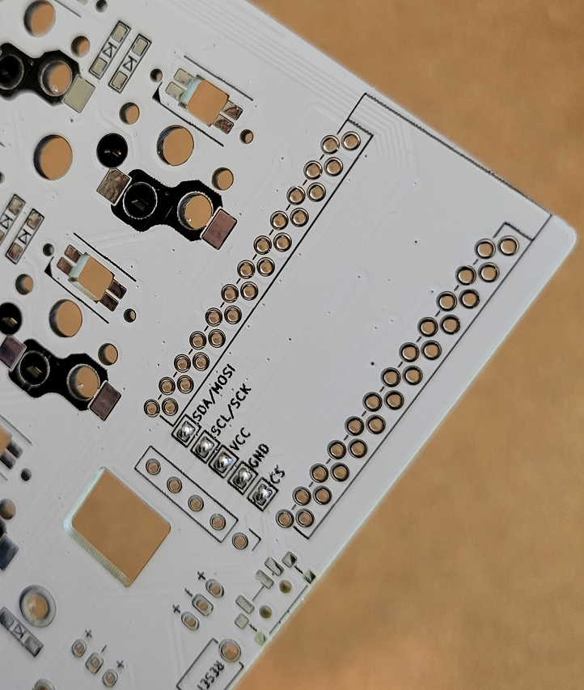

### Power switch and reset button

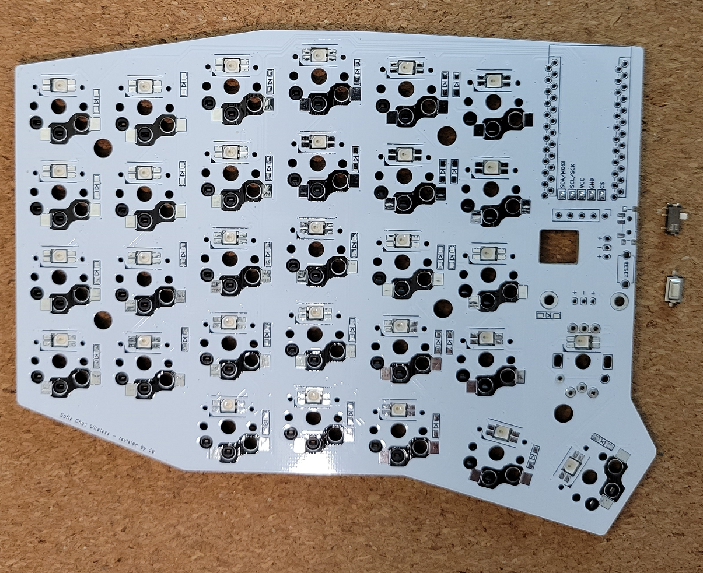

#### 电源开关

The power switch has 2 small bumps that fit into locating holes in the PCB, which help keep it in place while soldering. Tin one pad on the PCB, then put the switch in place over it. Put some downward pressure on the switch with tweezers, then press down on the switch leg that's sitting on the tinned pad with the iron until the switch leg sinks down fully into the solder, then remove the iron.

电源开关有两个小凸起，可以插入PCB上的定位孔中，有助于在焊接时将其固定到位。在PCB上安装一个衬垫，然后将开关安装在上面。用镊子向开关施加一些向下的压力，然后用烙铁向下按压位于镀锡衬垫上的引脚，直到引脚完全沉入焊料中，然后取下烙铁。

After this pin is soldered, solder the other pads by heating each leg and pad, then feeding solder into the joint until the joint fills with solder, then remove the iron.

Flux can be helpful for this step, as these are small surface-mount joints, but be careful not to use too much flux, as it can get into the mechanical part of the switch and potentially cause problems for the switch contact points. If possible, use a flux pen rather than flux paste, and in small amounts.

#### 重置按钮

Solder the reset button (aka tact switch). 

If using a through-hole type, insert the legs of the button into the holes and use masking tape to hold it in place if needed before soldering the legs in place from the back of the PCB. (This option is not pictured in this guide.)

If using a surface mount type, bend back the legs of the button to around 45 degrees before placing it onto the PCB.

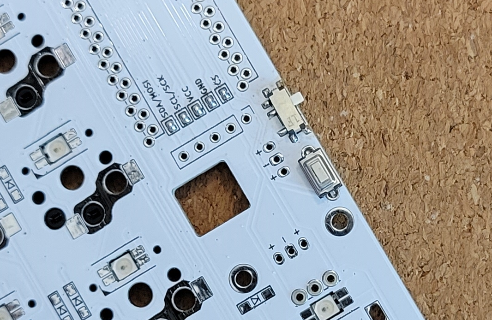

*The above shows the reset button in place before soldering. The power switch has already been soldered.*

With the button placed onto the PCB, heat up one of the pads and feed solder into the joint until solder fills the hole and covers the leg of the button. Once one side is soldered into place, heat up the remaining pad and fill the joint with solder, covering the leg of the button.


### 主控

There are various options for how the microcontroller can be installed. Here, we'll describe just a couple of those options:
1. The Spring Pin Header option
2. The Socket option

#### 排针直连方案
One option is to use spring pin headers. Using the 4mm variety will allow you to place a 301230 LiPo battery between the microcontroller and the PCB, which is the ideal place for it to keep the build as low-profile as possible. With the other socket options, the same type of battery will fit, as long as the sockets are tall enough.

If you use a 4mm spring pin header, installing the microcontroller with the components facing up will give the battery enough room to fit. However, this requires you to use the unmarked set of holes on the PCB. On the top of the PCB, the usual set of holes are marked with a black rectangle around them, which is intended for use with the microcontroller installed with components facing down, but if you install it with the components facing up, you must use the set of holes *without* with black rectangle around them, or the board will not function. For the components facing up configuration, the unmarked set of holes is the set of holes on the *left*, regardless of whether you're working on the left half or right half.

With the nice!nano, the spring pin headers will stay attached to the microcontroller without soldering it. This is not the case with all microcontrollers, as it is dependent on the size of the through-holes on the microcontroller's PCB. It just so happens that the nice!nano has the right sized holes for the spring pin headers to stay attached without soldering. Soldering the spring pin headers to the microcontroller board is an option suggested in some guides that mention this type of header, because many pro-micro compatible boards have larger through-holes, so the spring pin headers don't engage into the holes otherwise. If you choose to use a nice!nano and spring pin headers, soldering is not necessary to attach them to the controller or to the keyboard PCB. Keep in mind with this option, though, it's possible to dislodge the microcontroller with an accidental bump or with the force of inserting / removing the USB cable if it's not carefully pushed straight into the connector.

To attach the spring pin headers to the nice!nano:
 1. You can do all of this at the very end of the build, if, for example, you want to put your 301230 LiPo battery underneath the nice!nano. If you mount the nice!nano first, you will just end up taking the nice!nano back off later to put the battery in, then putting the nice!nano back into place, which is doable, but extra work.
 1. Be very careful with the spring pin headers! The spring loaded pins are very small and fragile and can come out of place if you try to force them in the wrong way. And if you break them, you may not be able to fix them.
 1. Make sure you don't put them into the nice!nano pins for battery + and -, as these pins are too small and will damage the spring pins
 1. Orient the two header rows so that the small holes in the headers both face the same side before inserting them into the nice!nano
 1. Carefully line up the pins and insert the spring pin headers into the nice!nano
 1. To fully seat them, press the headers into the nice!nano. Don't press against the tiny metal pins themselves, only put pressure on the plastic part. It helps to use tweezers to very carefully squeeze the headers against the microcontroller, only putting pressure on the plastic header part. This can also be done without tweezers using your fingernails to press down on the edge of the nice!nano.
 1. Once the headers are firmly pressed into the nice!nano, carefully line the pins up to the holes on the keyboard PCB and place the nice!nano into position so that it's resting on the correct pins. (If your nice!nano components face up, use the non-marked sets of holes on the left. If not, use the other set. If you're trying to fit a 301230 battery under the microcontroller, face the components up and use the non-marked sets of holes. Friendly reminder that you'll need the 4mm spring pin headers to be able to fit a battery underneath the nice!nano. The 2mm or 2.5mm varieties don't give you enough room to fit one.)
 1. Once the pins are resting in the keyboard PCB holes, use your fingers to press down evenly on the four corners of the nice!nano until the plastic part of the header is flush with the keyboard PCB.
 1. If you got this far, your nice!nano is connected to your keyboard PCB with no solder ever touching the nice!nano. Rejoice!

Even though mounting the nice!nano with spring pin headers will keep the nice!nano attached, it is possible to loosen it when plugging in or removing the USB cable from the microcontroller. Because of this, it's not the most stable type of mounting solution, but I still prefer to use it whenever I can. If you choose this method, make sure to check periodically that the header is fully flush with the keyboard PCB and the nice!nano, especially if you have been plugging in and unplugging the USB cable often. This is another good reason to get magnetic USB cables for your keyboard microcontrollers, since there is much less force required to attach and detach the magnetic cable than plugging a cable into the nice!nano's USB port.

##### PCB design side note
As a side note, different keyboard PCBs have different sized microcontroller holes, which means that even if the nice!nano holds onto them snugly, the PCB might not. For the Sofle and its ancestors (Lily58, Helix, Corne, Ergo42), the microcontroller holes on the PCB mostly seem to be the same, and they seem to fit the spring pin headers well.

#### 热插拔轴座方案
For this option, the microcontroller is installed on the top of the board, upside down and in the marked holes.

* Top of the board: this is the side of the PCB opposite the diodes, LEDs and switch sockets
* Upside down: both Pro Micro components should face the PCB with the mostly plain back facing out
* Marked holes: there are two sets of holes in the PCB, use the holes with the rectangular outline on the top of the board

Double-check your work here. This step is hard to reverse if a mistake is made.

To install a socketed microcontroller using the diode leg approach [from splitkb.com][promicrosocketing]:

  1. To solder the headers to the PCB, first place the 12-pin female headers on the top of the board in the outlined through holes. Use some tape to temporarily tack them in place. Flip the board over onto a flat, hard surface. While soldering the first pins, push down on the PCB to ensure the headers are perpendicular and fully seated.

  2. To install the diode legs, first flip the board upright again. Place some tape over the sockets before inserting the diode legs to prevent solder from seeping down into the sockets in the next step. Masking tape works fine for this. Place the microcontroller upside down on top of the sockets. Push the diode legs though the microcontroller holes and through the tape so they're seated into the socket below. It helps to use pliers to press the diode legs in, so you reduce the chances of stabbing yourself with a sharp diode leg while doing this.

  3. Solder the legs to the microcontroller. Snip off the legs above the microcontroller.

If you ever need to remove the microcontroller: do it by gently prying the board up in small increments, working your way gradually around the board. Don't be surprised if removing it is not easy, though -- the sockets can have a surprisingly strong grip on the diode legs. However, the diode legs themselves are very flexible and will easily bend if you pull the microcontroller off by one side of the board, rather than loosening it evenly and gradually on both sides. Avoid pressure on the USB connector. 


### 显示屏

When installed, the display will overhang the microcontroller. Since there are exposed components on the back of the display, adding some kapton tape or other insulating material to the bottom of the OLED module where it might contact the microcontroller is usually a good idea to prevent electrical shorting. Covering the exposed components on the back of the display is the main concern, as they have bare contact points that could short out against the microcontroller.

If you're using a 4-pin OLED display, use the 4 holes on the left which are outlined in a solid black outline on the PCB. If you're using a 5-pin display such as the nice!view, use a 5-pin female header, which is included with the display, and all 5 holes will be used.

If you're socketing the display (recommended), install the 4 or 5 pin female header on the top of the PCB and solder it into place. Then push the display pins into the socket. You may need to trim the male header pins so the insulation on the female and male headers mate and the display sits just above the microcontroller. The downside to socketing is that the display isn't as secure in the half height socket, and as a result, turning the keyboard upside down can cause the display to tilt away from the microcontroller somewhat. If you install a display cover, this is not as much of an issue, as the cover will keep the display from moving around too much.

### JST 连接器（可选配）

There are 2 places on the PCB where the JST connector can be installed: a horizontal row and a vertical column of 3 pins each. These are functionally identical. Either will work, but *do not connect batteries to both at the same time*. The board does not support connecting 2 batteries, so choose one or the other, whichever is more suited to your build.

*Pay very careful attention that the correct pins go into the correct holes*, or you could cause battery issues by getting the positive and negative wires flipped the wrong way. The correct holes to use for your JST socket depend on the plug coming from your battery. I recommend plugging your battery into the JST connector before placing it into the PCB to match it to the correct holes first. Below are the ways that your battery JST connector might be configured. The red wire could be on either the right or the left:

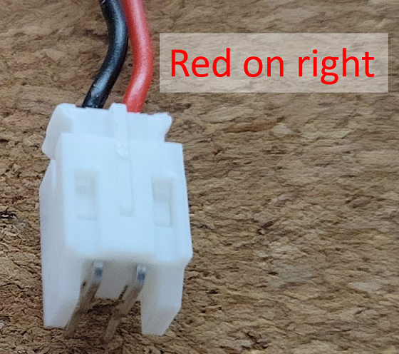

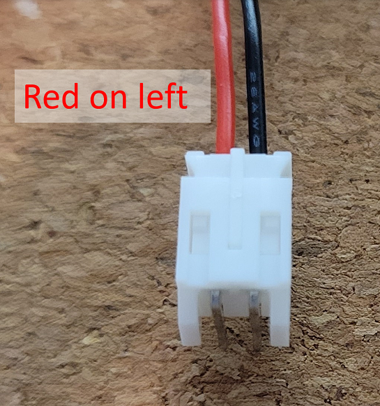

*The above 2 photos show the battery plugged into the JST connector before soldering, in order to tell which holes to use on the PCB*

Match RED to `+` and BLACK to `-`, which are labeled on the PCB. Since there are 3 holes in a row that are labeled `+`, `-`, `+`, the JST connector will fit into these in two positions, making it possible to get your connections flipped, causing potential battery issues, and also your board will not power on. 

With your battery plugged into the JST connector, match the pin connected to the RED wire to the `+` hole, and the BLACK wire to the `-` hole. 

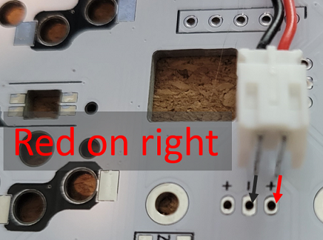

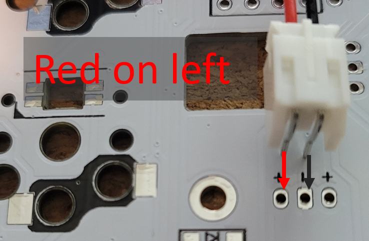

Once they're correctly matched, unplug the battery from the JST connector before soldering the JST connector to the PCB. Match the JST connector pins for both halves of the keyboard to ensure the proper connections are made on either side.


After determining the correct holes to solder your JST connector to, insert the JST connector into the holes. It helps to tape it into place, then flip the board over and solder the through-hole pins into place.

Alternatively, if your battery doesn't have a JST plug, you can solder your battery wires directly to the through holes on the board labeled `+` and `-`. RED goes to `+` and BLACK goes to `-`. This will allow the battery to be switched on and off by the switch.

## 安装旋钮编码器

If using the Mill-Max sockets for the encoder pin connections, make sure the pins on the encoder are all properly aligned before trying to insert into the sockets, then carefully insert the encoder into the sockets to avoid bending the pins if not properly aligned. Adjusting the larger "mounting point" pins can provide a little bit of mechanical stability, as they have a curve in them that can provide some additional pressure on the hole in the PCB to keep them in place. 

Keep in mind that the encoder will still be subject to a decent amount of movement if force is applied in a side-to-side direction. To address this, optionally, the two "mounting point" holes for the encoder (the larger oval-shaped holes with the rectangular solder pad) can be soldered in place to hold the encoder more securely. With these soldered, it is still much easier to desolder just these two mounting points to remove the encoder than if you solder all pins of the encoder to the PCB. 

It's also possible to solder all pins of the encoder and leave out the Mill-Max sockets entirely. If you choose to do this, insert the encoder into the PCB and solder all of the pins. It helps to provide some pressure on the encoder while soldering the first couple of pins, soldering 2 pins on opposite sides of the encoder will help hold it in place until the other pins are soldered. 


### 组装

- Snap a few switches into the top plate, the corner switches work best

- Place the PCB on a flat surface. This will save some strain on the solder joints in the next step (though they should be able handle it).

- Carefully lower the top plate with switches on the main PCB and push into sockets. Ensure pins are aligned.

- Snap the remaining switches into the top plate pressing into the sockets.

- There are no standoffs between the PCB and top plate

- Place the encoder knob on the shaft. Tighten the set screw with a hex key. A small screwdriver for glasses may do in a pinch.

- Optionally add display covers (aka OLED covers)

- Put at least 4 adhesive rubber feet, aka bumpons, in the corners so the keyboard doesn't move when you type. I find that it helps to have 5 total: 1 in each of the far corners, then another one along the top edge where there's a gentle corner (close to where the 8 and 9 keys are). Also, on the inner side of the board, the side where the microcontroller is, it feels more stable if you line up the 2 bumpons with each other vertically, instead of putting them as close to the far corners of the PCB as possible.


## 警告与声明

- Be gentle with the USB ports on your microcontrollers. They are not easy to fix if damaged. A magnetic USB connector is commonly used with microcontrollers to reduce the strain on the microcontroller's USB port when connecting and disconnecting from a USB cable.
- Keep in mind that this is a prototype of a DIY keyboard. It's not a polished product.

## 固件与编写

The Sofle Choc Wireless uses [ZMK Firmware][zmk_firmware].

The ZMK documentation has a guide for building and customizing your firmware, including customizing your keymap, setting your configuration options based on what devices and settings you use for your build, etc.: [ZMK Setup Guide][zmk_setup_guide]

This board uses the same layout as the Sofle keyboard that is already part of the ZMK repository, so your configurations can be done for the Sofle Choc Wireless keyboard as if it was the standard Sofle keyboard. The main differences for setting up your firmware build are whether you want to enable RGB LEDs and/or use the nice!view instead of the OLED display, which is the default supported display for the Sofle in ZMK. 

### nice!view 构建 ###
 To use the nice!view, you would need to add the nice_view_adapter and nice_view to your build config, so the build.yaml file would look something like this (*assuming you are building for the nice!nano v2 as your microcontroller board*): 

```
---
include:
  - board: nice_nano_v2
    shield: sofle_left nice_view_adapter nice_view
  - board: nice_nano_v2
    shield: sofle_right nice_view_adapter nice_view
```

Another config option that's necessary for the nice!view to work properly is the following line to be included in the `sofle.conf` file of your config repository:

```
CONFIG_ZMK_DISPLAY_WORK_QUEUE_DEDICATED=y
```
Without this config option, your keyboard may freeze, experience lag, or have connection issues. This option may be set as a default in the future, but at the time of writing this, it is not defaulted yet.

### RGB 配置 ###

For setting up RGB LEDs, the controller pin used for these corresponds to pin 8 of the nice!nano (Arduino Digital 0 / D0 Pro Micro pin), so if using a nice!nano, the LED config line you would need to use is `mosi-pin = <8>;` within your SPI configuration if building for the nice!nano. Also, note that since there are 30 LEDs on the Sofle Choc Wireless, you would use `chain-length = <30>;`. For more guidance on configuring LEDs, refer to the ZMK documentation for this topic: https://zmk.dev/docs/features/underglow.


### zmk-config 示例仓库以及有用的固件构建提示
Common configurations are set up in this repo: https://github.com/db-ok/zmk-config-soflechocwireless

#### 基础配置
The `main` branch is the "stock" configuration/keymap*, with the OLED and rotary encoder configuration options enabled in the .conf file.
*Note that OLED displays have a slight issue when a firmware is first flashed (at least for the nice!nano). The external power defaults to OFF for devices such as the OLED display, so you must turn it on after flashing the firmware in order for the display to turn on. In addition to that, the screen may not turn on right away, even after toggling the power, so after toggling the external power ON, wait about 1 minute, then reset each half of the keyboard. At this point, the screen should turn on. After that, I recommend avoiding toggling the external power OFF, as it may not turn on again after toggling it to OFF. Hopefully, this will get fixed in a future ZMK release.*

*The exception to the default keymap is that the `&ext_power EP_TOG` included, as it is necessary to turn on the external power used by the OLED.

-- `main` branch: https://github.com/db-ok/zmk-config-soflechocwireless/tree/main


#### OLED 和 RGB 配置
The `oled-rgb` branch is set up to build firmware that enables the OLED display and the RGB underglow lighting. It includes the necessary config options to enable these features, and a keymap for the RGB toggle so that you can turn the RGB light on or off on demand. The RGB config is contained in the keymap, along with comments about why this is done that way. In the future, the RGB config may be done some other way, as this is kind of a workaround for the nice!nanoV2 currently. You may also want to add more controls for the RGB lighting on your keymap. If so, refer to https://zmk.dev/docs/behaviors/underglow for the RGB lighting behavior keymap options so that you can add those controls to your keymap.

*See above description of the Basic config for description of how to get the OLED display working after flashing the firmware.*

-- `oled-rgb` branch: https://github.com/db-ok/zmk-config-soflechocwireless/tree/oled-rgb

#### nice!view config
The `niceview` branch is an example of a firmware that enables the nice!view display without RGB lighting. This is a great configuration for long battery life while still having the benefits of the display.

-- `niceview` branch: https://github.com/db-ok/zmk-config-soflechocwireless/tree/niceview

#### nice!view with RGB config
The `niceview-rgb` branch is an example of a configuration that supports both a nice!view display and RGB lighting.

-- `niceview-rgb` branch: https://github.com/db-ok/zmk-config-soflechocwireless/tree/niceview-rgb

## Troubleshooting

Refer to the build guide for hardware troubleshooting. The [ZMK discord](https://discord.gg/WxGbYWEtsw) is also very helpful for firmware and keymap questions.


## 参考链接

- [ZMK Firmware][zmk_firmware]
- [Original Sofle Choc Layout in KeyboardLayout editor][soflechoclayout] (for reference only, this may not match the default layout in ZMK)
- [Sourcing parts](https://github.com/josefadamcik/SofleKeyboard/blob/master/docs/sourcing_parts.md) - some of these may apply, but keep in mind many components are targeted at wired builds
- [NiceKeyboards](https://nicekeyboards.com/) - details about nice!nano and nice!view, and links to vendors where they're sold


[zmk_firmware]: <https://zmk.dev/> "ZMK Firmware"
[zmk_setup_guide]: <https://zmk.dev/docs/user-setup> "ZMK Setup Guide"
[layoutarticle]: <https://josef-adamcik.cz/electronics/in-search-of-the-best-custom-keyboard-layout.html> "In search of the best custom keyboard layout"
[introductionarticle]: <https://josef-adamcik.cz/electronics/let-me-introduce-you-sofle-keyboard-split-keyboard-based-on-lily58.html> "Let me introduce you SofleKeyboard - a split keyboard based on Lily58 and Crkbd"
[soflechoclayout]: http://www.keyboard-layout-editor.com/#/gists/5604075ad16c10a8c634828c5911d2b6 "Sofle Choc Keyboard layout at keyboard-layout-editor.com"
[qmk_firmware]: https://github.com/qmk/qmk_firmware/ "QMK firmware"


[qmk_configurator]: https://config.qmk.fm/#/sofle/rev1/LAYOUT "QMK configurator"
[springpinheader]: <https://yushakobo.jp/shop/a01mc-00/> "Spring pin headers - Japanese"
[qmkprotonc]: https://qmk.fm/proton-c/ "QMK Proton-C"
[promicrosocketing]: <https://docs.splitkb.com/hc/en-us/articles/360011263059> "How do I socket a microcontroller? by splitkb.com"
[qmkintro]: <https://beta.docs.qmk.fm/newbs/newbs_getting_started> "QMK getting started"
[qmkhandedness]: <https://docs.qmk.fm/#/feature_split_keyboard?id=setting-handedness> "QMK firmware - setting handedness"
[manufacturingproblems]: https://josef-adamcik.cz/electronics/corne-keyboard-build-log.html#manufacturing-at-jlcpcb---update-27112019 "Possible problems when manufacturing top plate for Corne"
[nooledlag]: https://github.com/qmk/qmk_firmware/issues/7522 "No OLED lag bug"
[soflegithub]: https://github.com/josefadamcik/SofleKeyboard "SofleKeyboard - KiCad project on Github.com"
[sourcing]: <{{ site.baseurl }}/sourcing_parts.html> "Sourcing parts"
